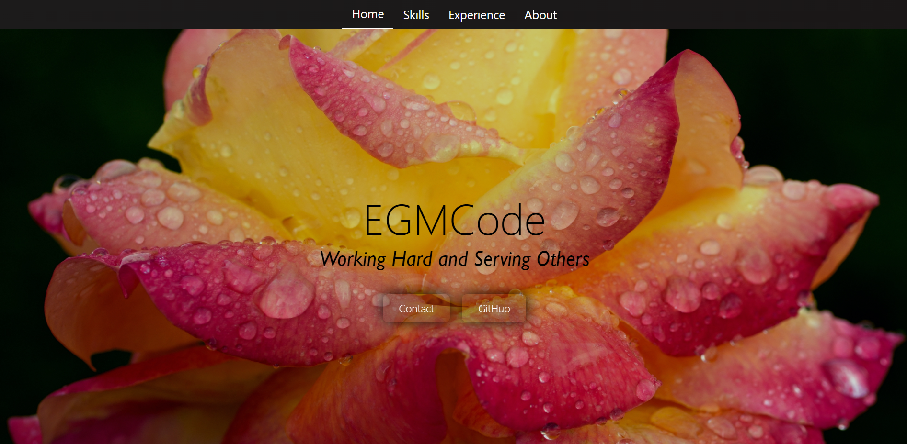
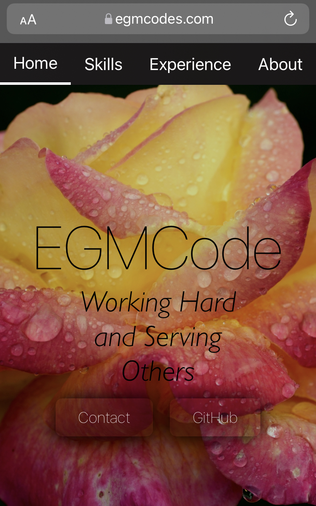

EGMCode Portfolio Site
---------------------------
 
Thank you for taking the time to learn about me!

This is the repo for one of the backend REST APIs built 
using Spring Boot and a MySQL database; it serves most 
of the information about me. 

*The use of different technologies between the two backend
services was more so for demonstration purposes*

To find the other backend service and the frontend code,
please visit these repos:

<a href='https://github.com/egmcode/PortfolioAuthBackEnd'>PortfolioAuthBackEnd</a>

<a href='https://github.com/egmcode/PortfolioFrontEnd'>PortfolioFrontEnd</a>

You can find my site here:

https://egmcodes.com

You can also try it on mobile:

